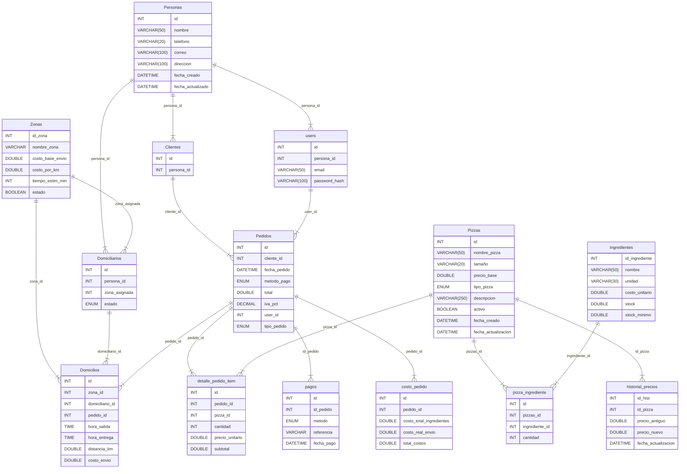

# Proyecto MySql 2 Alexi Durán Gómez


## Pizzería don Piccolo
La empresa **Pizzería Don Piccolo** desea implementar un sistema de gestión de pedidos y domicilios para mejorar el control de sus operaciones.
Actualmente, la empresa maneja los pedidos de forma manual, lo que genera retrasos en la atención y errores en los registros de clientes y entregas.
Tu misión es diseñar y desarrollar la base de datos que permita gestionar los clientes, pizzas, ingredientes, pedidos, repartidores, domicilios y pagos, además de crear funciones, triggers y vistas para optimizar las consultas del negocio.


### Objetivo general
Diseñar un sistema de base de datos relacional en MySQL que permita gestionar la información completa del proceso de venta de pizzas y domicilios, desde el registro de pedidos hasta su entrega y pago.


### Requerimientos funcionales

1. **Gestión de Clientes**

- Registrar información de clientes: nombre, teléfono, dirección y correo electrónico.
- Permitir identificar clientes frecuentes (más de 5 pedidos en el mes).

2. **Gestión de Pizzas**

- Registrar las pizzas disponibles: nombre, tamaño, precio base y tipo (vegetariana, especial, clásica).
- Relacionar pizzas con sus ingredientes.
- Controlar disponibilidad de ingredientes.

3. **Gestión de Pedidos**

- Registrar pedidos con:
    - Cliente
    - Fecha y hora del pedido
    - Pizzas solicitadas (una o varias)
    - Método de pago (efectivo, tarjeta, app)
    - Estado del pedido (pendiente, en preparación, entregado, cancelado)
    - Total del pedido (calculado con función)

4. **Gestión de Repartidores**

- Registrar repartidores con su nombre, zona asignada, y estado (disponible/no disponible).
- Asignar un repartidor a cada pedido de domicilio.

5. **Gestión de Domicilios**

- Cada domicilio está asociado a un pedido.
- Debe registrar:
    - Hora de salida del repartidor
    - Hora de entrega
    - Distancia aproximada
    - Costo del envío (según distancia o zona)

### Funciones y Procedimientos

1. Función para calcular el total de un pedido (sumando precios de pizzas + costo de envío + IVA).
2. Función para calcular la ganancia neta diaria (ventas - costos de ingredientes).
3. Procedimiento para cambiar automáticamente el estado del pedido a “entregado” cuando se registre la hora de entrega.

#### Triggers

1. Trigger de actualización automática de stock de ingredientes cuando se realiza un pedido.
2. Trigger de auditoría que registre en una tabla historial_precios cada vez que se modifique el precio de una pizza.
3. Trigger para marcar repartidor como “disponible” nuevamente cuando termina un domicilio.

#### Consultas SQL requeridas

- Clientes con pedidos entre dos fechas (BETWEEN).
- Pizzas más vendidas (GROUP BY y COUNT).
- Pedidos por repartidor (JOIN).
- Promedio de entrega por zona (AVG y JOIN).
- Clientes que gastaron más de un monto (HAVING).
- Búsqueda por coincidencia parcial de nombre de pizza (LIKE).
- Subconsulta para obtener los clientes frecuentes (más de 5 pedidos mensuales).

#### Vistas

1. Vista de resumen de pedidos por cliente (nombre del cliente, cantidad de pedidos, total gastado).
2. Vista de desempeño de repartidores (número de entregas, tiempo promedio, zona).
3. Vista de stock de ingredientes por debajo del mínimo permitido.


## Resultado esperado

### Entregables

1. Script de creación de base de datos y tablas (CREATE DATABASE / CREATE TABLE)
2. Relaciones con llaves foráneas (FOREIGN KEY)
3. Scripts con funciones, procedimientos y triggers (CREATE FUNCTION / PROCEDURE / TRIGGER)
4. Consultas SQL complejas (JOIN, subconsultas, operadores, agregaciones)
5. Vistas de reportes (CREATE VIEW)
6. Archivo README con:
    - Descripción del proyecto
    - Explicación de las tablas y relaciones
    - Ejemplos de consultas
    - Instrucciones para ejecutar el script

### Estructura esperada del proyecto

```cmd
/pizzeria-don-piccolo/
 ├── database.sql
 ├── funciones.sql
 ├── triggers.sql
 ├── vistas.sql
 ├── consultas.sql
 └── README.md
```

<br>

--- 
## Documetación


# Pizzería Don Piccolo - Base de Datos



## Descripción
Sistema relacional en MySQL para gestionar clientes, pizzas, ingredientes, pedidos, repartidores, domicilios y pagos. Incluye funciones, triggers, vistas y consultas.

## Estructura del proyecto

```cmd
/pizzeria-don-piccolo/
 ├── database.sql      -- tablas y datos base
 ├── funciones.sql     -- funciones y procedimientos
 ├── triggers.sql      -- triggers para stock, auditoría, etc.
 ├── vistas.sql        -- vistas de reportes
 ├── consultas.sql     -- consultas de ejemplo
 └── README.md
```

## Instrucciones
1. Ejecutar `database.sql`.
2. Ejecutar `funciones.sql`.
3. Ejecutar `triggers.sql`.
4. Ejecutar `vistas.sql`.
5. Ejecutar `consultas.sql` para ver ejemplos.

## Principales tablas
- personas, roles, persona_rol
- ingredientes, pizzas, pizza_ingredientes
- pedidos, pedido_items, domicilios, repartidores, pagos
- historial_precios

## Notas importantes
- Validar stock antes de confirmar pedidos (usar transacciones).
- Triggers actualizan stock y estado de repartidor; ajustar según flujo real.
- La función `fn_ganancia_neta_diaria` es aproximada; si tus recetas difieren por tamaño, ajustar la tabla `pizza_ingredientes`.


## Indices
En un sistema real deberías indexar:

- Pedidos(cliente_id)
- Pedidos(user_id)
- Pedidos(fecha_pedido)
- detalle_pedido_item(pedido_id)
- Domicilios(pedido_id) (UNIQUE recomendado)