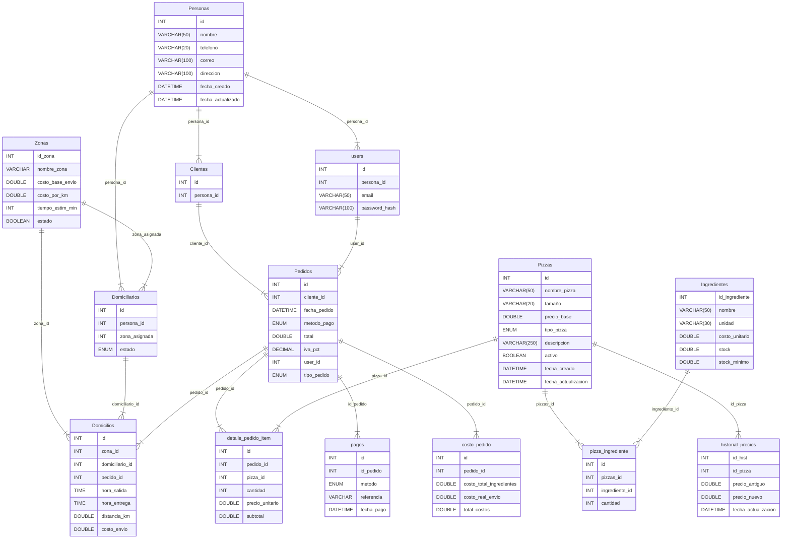
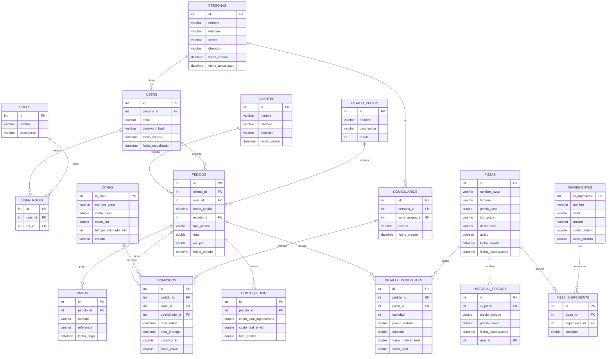

# Archietecture file

BEFORE FIXED

```mermaid

erDiagram

    Personas {
        INT id
        VARCHAR(50) nombre
        VARCHAR(20) telefono
        VARCHAR(100) correo
        VARCHAR(100) direccion
        DATETIME fecha_creado
        DATETIME fecha_actualizado
    }

    Clientes {
        INT id
        INT persona_id
    }

    users {
        INT id
        INT persona_id
        VARCHAR(50) email
        VARCHAR(100) password_hash
    }

    Domiciliarios {
        INT id
        INT persona_id
        INT zona_asignada
        ENUM estado
    }

    Zonas {
        INT id_zona
        VARCHAR nombre_zona
        DOUBLE costo_base_envio
        DOUBLE costo_por_km
        INT tiempo_estim_min
        BOOLEAN estado
    }

    Domicilios {
        INT id
        INT zona_id
        INT domiciliario_id
        INT pedido_id
        TIME hora_salida
        TIME hora_entrega
        DOUBLE distancia_km
        DOUBLE costo_envio
    }

    Pedidos {
        INT id
        INT cliente_id
        DATETIME fecha_pedido
        ENUM metodo_pago
        DOUBLE total
        DECIMAL iva_pct
        INT user_id
        ENUM tipo_pedido
    }

    Pizzas {
        INT id
        VARCHAR(50) nombre_pizza
        VARCHAR(20) tamaño
        DOUBLE precio_base
        ENUM tipo_pizza
        VARCHAR(250) descripcion
        BOOLEAN activo
        DATETIME fecha_creado
        DATETIME fecha_actualizacion
    }

    Ingredientes {
        INT id_ingrediente
        VARCHAR(50) nombre
        VARCHAR(30) unidad
        DOUBLE costo_unitario
        DOUBLE stock
        DOUBLE stock_minimo
    }

    pizza_ingrediente {
        INT id
        INT pizzas_id
        INT ingrediente_id
        INT cantidad
    }

    detalle_pedido_item {
        INT id
        INT pedido_id
        INT pizza_id
        INT cantidad
        DOUBLE precio_unitario
        DOUBLE subtotal
    }

    pagos {
        INT id
        INT id_pedido
        ENUM metodo
        VARCHAR referencia
        DATETIME fecha_pago
    }

    costo_pedido {
        INT id
        INT pedido_id
        DOUBLE costo_total_ingredientes
        DOUBLE costo_real_envio
        DOUBLE total_costos
    }

    historial_precios {
        INT id_hist
        INT id_pizza
        DOUBLE precio_antiguo
        DOUBLE precio_nuevo
        DATETIME fecha_actualizacion
    }

    %% RELACIONES
    Personas ||--|{ Clientes : "persona_id"
    Personas ||--|{ users : "persona_id"
    Personas ||--|{ Domiciliarios : "persona_id"

    Zonas ||--|{ Domiciliarios : "zona_asignada"
    Zonas ||--|{ Domicilios : "zona_id"

    Domiciliarios ||--|{ Domicilios : "domiciliario_id"

    Clientes ||--|{ Pedidos : "cliente_id"
    users ||--|{ Pedidos : "user_id"

    Pedidos ||--|{ Domicilios : "pedido_id"
    Pedidos ||--|{ detalle_pedido_item : "pedido_id"
    Pedidos ||--|{ pagos : "id_pedido"
    Pedidos ||--|{ costo_pedido : "pedido_id"

    Pizzas ||--|{ detalle_pedido_item : "pizza_id"
    Pizzas ||--|{ pizza_ingrediente : "pizzas_id"
    Pizzas ||--|{ historial_precios : "id_pizza"

    Ingredientes ||--|{ pizza_ingrediente : "ingrediente_id"

```

AFTER FIXED

```mermaid

erDiagram

    PERSONAS {
        int id PK
        varchar nombre
        varchar telefono
        varchar correo
        varchar direccion
        datetime fecha_creado
        datetime fecha_actualizado
    }

    USERS {
        int id PK
        int persona_id FK
        varchar email
        varchar password_hash
        datetime fecha_creado
        datetime fecha_actualizado
    }

    ROLES {
        int id PK
        varchar nombre
        varchar descripcion
    }

    USER_ROLES {
        int id PK
        int user_id FK
        int rol_id FK
    }

    CLIENTES {
        int id PK
        varchar nombre
        varchar telefono
        varchar direccion
        datetime fecha_creado
    }

    ZONAS {
        int id_zona PK
        varchar nombre_zona
        double costo_base
        double costo_km
        int tiempo_estimado_min
        varchar estado
    }

    DOMICILIARIOS {
        int id PK
        int persona_id FK
        int zona_asignada FK
        varchar estado
        datetime fecha_creado
    }

    PEDIDOS {
        int id PK
        int cliente_id FK
        int user_id FK
        datetime fecha_pedido
        int estado_id FK
        varchar tipo_pedido
        double total
        double iva_pct
        datetime fecha_creado
    }

    ESTADO_PEDIDO {
        int id PK
        varchar nombre
        varchar descripcion
        int orden
    }

    PAGOS {
        int id PK
        int pedido_id FK
        varchar metodo
        varchar referencia
        datetime fecha_pago
    }

    DOMICILIOS {
        int id PK
        int pedido_id FK
        int zona_id FK
        int domiciliario_id FK
        datetime hora_salida
        datetime hora_entrega
        double distancia_km
        double costo_envio
    }

    COSTO_PEDIDO {
        int id PK
        int pedido_id FK
        double costo_total_ingredientes
        double costo_real_envio
        double total_costos
    }

    PIZZAS {
        int id PK
        varchar nombre_pizza
        varchar tamano
        double precio_base
        varchar tipo_pizza
        varchar descripcion
        boolean activo
        datetime fecha_creado
        datetime fecha_actualizacion
    }

    HISTORIAL_PRECIOS {
        int id PK
        int id_pizza FK
        double precio_antiguo
        double precio_nuevo
        datetime fecha_actualizacion
        int user_id FK
    }

    INGREDIENTES {
        int id_ingrediente PK
        varchar nombre
        double stock
        varchar unidad
        double costo_unitario
        double stock_minimo
    }

    PIZZA_INGREDIENTE {
        int id PK
        int pizza_id FK
        int ingrediente_id FK
        double cantidad
    }

    DETALLE_PEDIDO_ITEM {
        int id PK
        int pedido_id FK
        int pizza_id FK
        int cantidad
        double precio_unitario
        double subtotal
        double costo_unitario_total
        double costo_total
    }


    %% ---------------------
    %% RELACIONES
    %% ---------------------

    PERSONAS ||--o{ USERS : "tiene"
    PERSONAS ||--o{ DOMICILIARIOS : "es"

    USERS ||--o{ USER_ROLES : "asigna"
    ROLES ||--o{ USER_ROLES : "tiene"

    CLIENTES ||--o{ PEDIDOS : "realiza"
    USERS ||--o{ PEDIDOS : "registró"

    ESTADO_PEDIDO ||--o{ PEDIDOS : "estado"

    PEDIDOS ||--o{ PAGOS : "pago"

    PEDIDOS ||--o| DOMICILIOS : "tiene"
    ZONAS ||--o{ DOMICILIOS : "en zona"
    DOMICILIARIOS ||--o{ DOMICILIOS : "entrega"

    PEDIDOS ||--o{ COSTO_PEDIDO : "costos"

    PIZZAS ||--o{ HISTORIAL_PRECIOS : "cambios"

    PIZZAS ||--o{ PIZZA_INGREDIENTE : "incluye"
    INGREDIENTES ||--o{ PIZZA_INGREDIENTE : "usado en"

    PEDIDOS ||--o{ DETALLE_PEDIDO_ITEM : "detalle"
    PIZZAS ||--o{ DETALLE_PEDIDO_ITEM : "pizza"

```